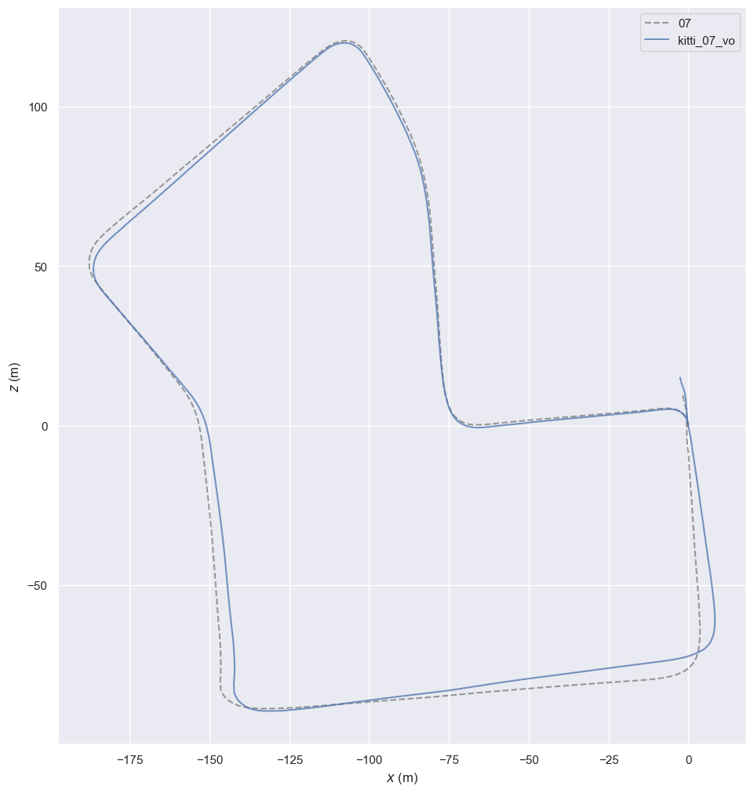
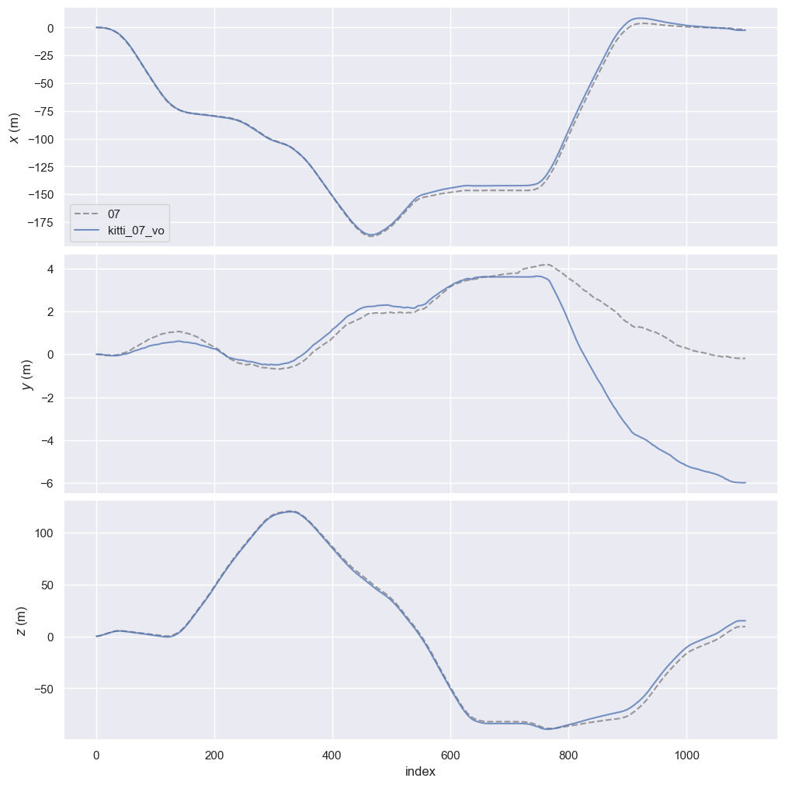

# Stereo Visual Odometry on KITTI

First module of a longer SLAM project. Goal of this stage: a stereo VO pipeline that produces a metric-scale 6-DOF trajectory from KITTI image pairs, evaluated against ground truth.

## Pipeline

Per frame, the loop runs:

1. If a new keyframe is needed: detect ORB features in the left image, run SGBM stereo matching for a dense disparity map, and triangulate each keypoint into a 3D point in the keyframe's camera frame.
2. Otherwise: track the keyframe's features into the current frame using Lucas-Kanade optical flow, filtered with a forward-backward consistency check.
3. Run PnP-RANSAC against the keyframe's 3D points and the current frame's tracked 2D positions to estimate the relative pose.
4. Compose with the keyframe's world pose to get the current frame's world pose. Append to trajectory.
5. Check the keyframe criterion (translation, rotation, or feature loss). If it fires, this frame becomes the new keyframe.

Module layout in `src/vo/`: `features.py` (ORB + LK), `stereo.py` (SGBM + triangulation), `motion.py` (PnP wrapper), `keyframes.py` (criterion), `trajectory.py` (SE(3) accumulation + KITTI I/O). Main loop in `scripts/run_vo.py`.

## Design choices

### Stereo 3D-to-2D PnP over alternatives

Two alternatives I considered:

- **Monocular 2D-2D essential matrix.** Recovers translation only as a unit vector, no metric scale. Defeats the point of having stereo.
- **Stereo-stereo point cloud alignment** (triangulate at both frames, then ICP/Procrustes). Both sides of the alignment carry stereo depth noise, especially in the Z direction (1px disparity error at 50m is roughly 3m depth error), so errors compound on both ends.

PnP triangulates 3D once at the keyframe and uses 2D pixel observations (sub-pixel precision) at every subsequent frame. The optimization minimizes reprojection error in pixel space, which is much better-conditioned than aligning two noisy point clouds.

### Keyframe-anchored tracking, not frame-to-frame chaining

Two reasons to anchor PnP back to a keyframe instead of chaining `frame[i-1] → frame[i]` every step:

1. **Stereo cost.** SGBM runs once per keyframe (~100 times on KITTI 07) instead of once per frame (1101 times). Roughly 10x speedup on the heaviest operation.
2. **Drift.** Each PnP has small error. Frame-to-frame chains accumulate error every frame. Keyframe-anchored estimates the cumulative kf→curr motion in a single PnP call, so within a keyframe segment, errors don't compound. Drift only accumulates *between* keyframes (~10 frames typically).

Optical flow still chains across intermediate frames — that's just to keep features alive long enough to track them back to the keyframe. The pose math always anchors to the keyframe.

### Parameter choices

| Parameter | Value | Why |
|---|---|---|
| ORB features per keyframe | 2000 | More = more PnP-RANSAC inliers, but diminishing returns past ~2000. |
| Depth bounds for triangulation | [1m, 80m] | Below 1m: usually bad disparity (sky reflections, ego-vehicle). Above 80m: depth uncertainty exceeds ~10% of the measurement, those points hurt PnP more than they help. |
| LK window size | 21x21 | Standard for VO. Smaller windows are noisier; larger windows blur edges. |
| LK pyramid levels | 3 (4 total resolutions) | Handles motion up to ~150 px between consecutive frames. KITTI's 10 Hz urban driving never exceeds this. |
| Forward-backward LK threshold | 1.0 px | Catches LK convergence-to-wrong-feature errors that the status flag misses. |
| PnP reprojection threshold | 2.0 px | Loose enough to keep most inliers despite optical flow noise; tight enough to reject genuine outliers. |
| PnP RANSAC iterations | 100 | Plenty for ~1500 candidate points with ~80% inlier rate. |
| Keyframe translation threshold | 1.0 m | Roughly 1 frame of motion at KITTI's typical driving speed. |
| Keyframe rotation threshold | 10° | Significant view change. Straight driving stays well under. |
| Keyframe feature ratio | 0.7 | Once 30% of the keyframe's tracks are lost, the remaining set is too sparse for stable PnP. |

The keyframe thresholds come from the original ORB-SLAM paper. The depth bounds came from working out the depth-uncertainty math for KITTI's stereo rig and picking a cap where uncertainty crosses 10% of measurement value.

### SE(3) composition direction

PnP returns the transform $T_{\text{curr} \leftarrow \text{kf}}$ — points in keyframe coords mapped into current-frame coords. Camera motion in world coords is the inverse, so the trajectory accumulation is:

$$T_{\text{world} \leftarrow \text{curr}} = T_{\text{world} \leftarrow \text{kf}} \cdot T_{\text{kf} \leftarrow \text{curr}}$$

where $T_{\text{kf} \leftarrow \text{curr}} = (T_{\text{curr} \leftarrow \text{kf}})^{-1}$. The inverse uses the closed-form for SE(3): rotation transposes, translation becomes $-R^T t$. About 10x faster than `np.linalg.inv` and exact (no LU decomposition error).

## Results

Evaluated on KITTI Odometry sequence 07 (1101 frames, ~695m, partial loop) using `evo`.

| Metric | Value |
|---|---|
| ATE RMSE | 2.4 m |
| RPE (100m) | 1.37 m / 100m (1.37%) |
| Path length ratio (VO/GT) | 1.001 |
| Loop closure gap (start to end) | 16.4 m (vs GT's 9.5 m) |
| Runtime | ~2 min for 1101 frames on CPU |

The 1.37% RPE compares favorably with published stereo VO baselines on KITTI 07 (typically 1-2% without bundle adjustment or loop closure).

The trajectory matches GT well in x and z but drifts in y (vertical):

Y-axis ends 6m below GT after 700m of nearly-flat driving. Without an absolute gravity reference, small per-frame pitch errors integrate into elevation drift. This is the classic vision-only failure mode and is the main motivation for adding IMU fusion later.

## Limitations

- No global consistency. Drift accumulates without bound; the 16.4m end-to-start gap on KITTI 07 is real and would grow on longer sequences. Loop closure with pose graph optimization is the standard fix.
- No gravity reference, hence the y-axis drift.
- Assumes calibrated rectified stereo with a fixed baseline. Robust on KITTI's clean rig; will be more challenging on a custom rig.
- Performance depends on scene texture. Urban driving is feature-rich; low-texture environments (indoor walls, foggy outdoor, highway) would degrade tracking.

## Code

- [`src/vo/features.py`](src/vo/features.py): ORB + LK with bidirectional filter
- [`src/vo/stereo.py`](src/vo/stereo.py): SGBM disparity + triangulation
- [`src/vo/motion.py`](src/vo/motion.py): PnP-RANSAC wrapper
- [`src/vo/keyframes.py`](src/vo/keyframes.py): keyframe selection
- [`src/vo/trajectory.py`](src/vo/trajectory.py): SE(3) trajectory + KITTI I/O
- [`src/utils/transforms.py`](src/utils/transforms.py): SE(3) helpers
- [`scripts/run_vo.py`](scripts/run_vo.py): main loop