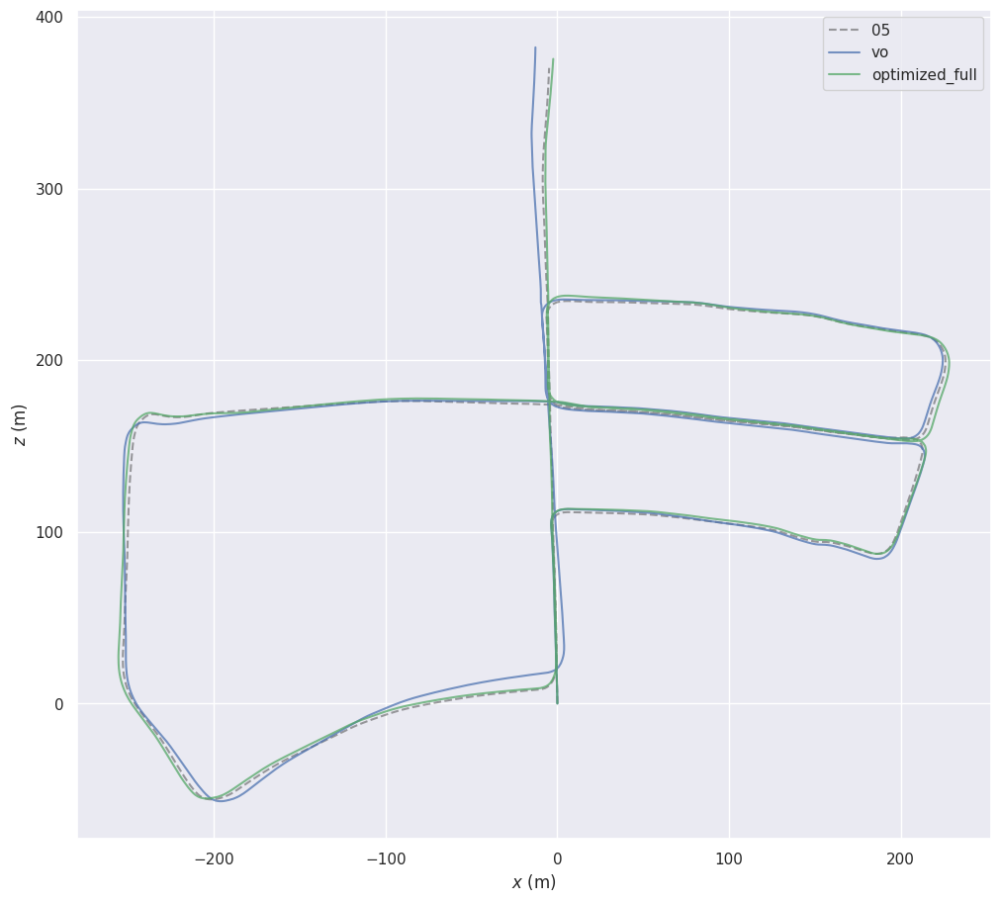
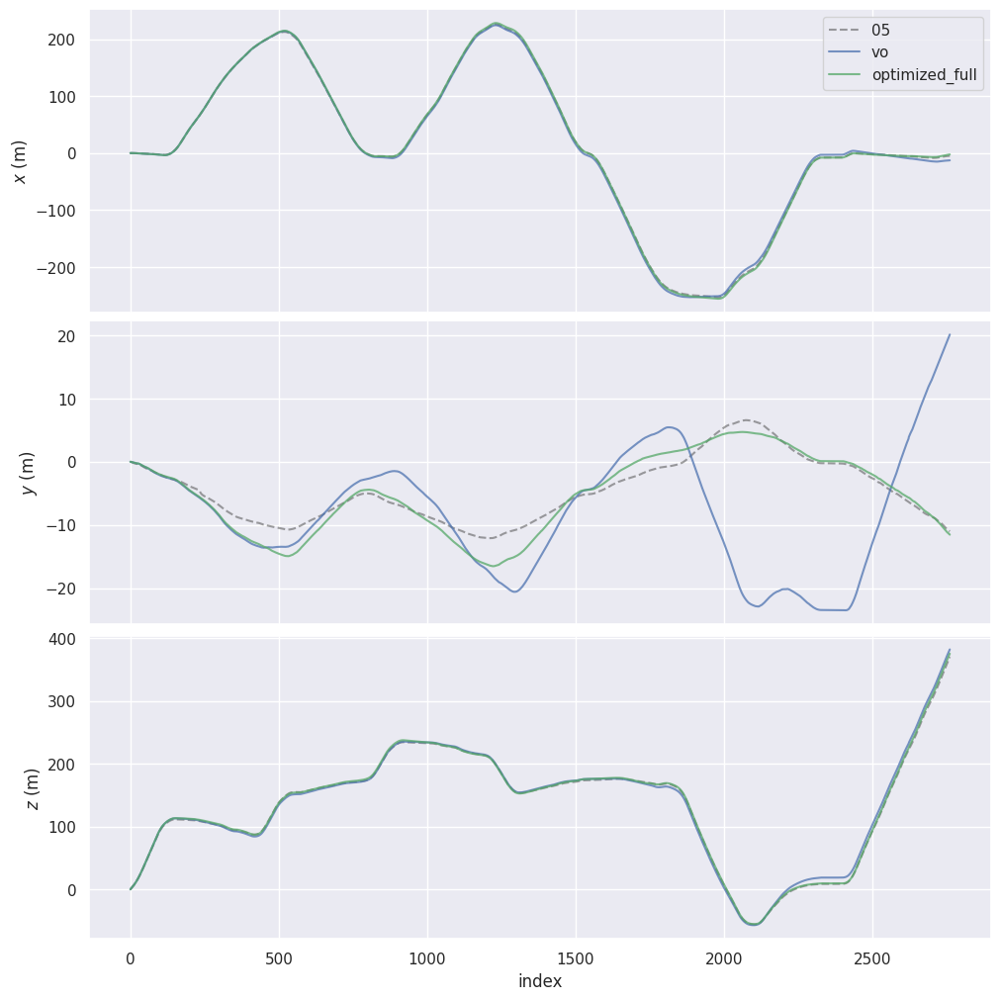

# Stereo Visual Odometry + Loop Closure on KITTI

First two modules of a longer SLAM project. Stereo VO produces a metric-scale 6-DOF trajectory from KITTI image pairs. Bag-of-Words loop closure detection finds revisits to previously-seen places, and GTSAM pose graph optimization redistributes accumulated drift across the trajectory using these constraints.

## Pipeline

### Visual odometry

For frame 0: detect ORB features, run SGBM stereo, triangulate to get the initial keyframe's 3D points. Subsequent frames run:

1. Track the keyframe's features into the current frame using Lucas-Kanade optical flow, filtered with a forward-backward consistency check.
2. Run PnP-RANSAC against the keyframe's 3D points and the tracked 2D positions to estimate the current frame's pose relative to the keyframe.
3. Compose with the keyframe's world pose to get the current frame's world pose. Append to trajectory.
4. Check the keyframe criterion (translation, rotation, or feature loss). If it fires, re-detect ORB features in the current frame, run SGBM stereo, triangulate fresh 3D points, and treat this frame as the new keyframe (with `kf_pose` = current frame's world pose).

Module layout in `src/vo/`: `features.py` (ORB + LK), `stereo.py` (SGBM + triangulation), `motion.py` (PnP wrapper), `keyframes.py` (criterion), `trajectory.py` (SE(3) accumulation + KITTI I/O), `keyframe_logger.py` (saves keyframe descriptors and 3D points so the loop closure stage can match against them later). Main loop in `scripts/run_vo.py`.

### Loop closure detection

Two-stage pipeline: BoW retrieval as a coarse filter, geometric verification as a fine filter.

**Stage 1: Vocabulary training.** Aggregate all keyframes' ORB descriptors into one big array (~$10^6$ descriptors total). Run k-means clustering with k=1000 to find 1000 representative descriptor centroids - the "visual words." This builds a discrete dictionary the system uses to describe scenes.

**Stage 2: BoW database.** For each keyframe, encode its descriptors as a TF-IDF weighted histogram over the 1000 vocabulary words:

$$\text{tf}(w, d) = \frac{\text{count}(w \text{ in } d)}{|d|}, \quad \text{idf}(w) = \log\frac{N}{\text{df}(w)}, \quad v_d[w] = \text{tf}(w, d) \cdot \text{idf}(w)$$

After L2-normalizing $v_d$, cosine similarity between two keyframes reduces to a dot product:

$$\text{sim}(d_1, d_2) = v_{d_1} \cdot v_{d_2}$$

The whole database is a $(N_\text{keyframes} \times 1000)$ matrix; queries are matrix-vector products. Sub-second on KITTI sequences.

**Stage 3: Loop detection.** For each keyframe, query the database for its top-k most similar keyframes (excluding self and a temporal window of nearby keyframes). Each candidate above a BoW similarity threshold gets passed to geometric verification.

**Stage 4: Geometric verification.** ORB descriptor matching with Lowe's ratio test (each match must be sufficiently better than the second-best alternative), then PnP-RANSAC using kf_a's stored 3D points (in kf_a's camera frame) and kf_b's matched 2D pixels. Loops with ≥20 PnP inliers at 2px reprojection threshold are accepted; the recovered transform $T_{a \to b}$ becomes the loop closure constraint.

**Stage 5: Deduplication.** Querying with both kf_a and kf_b can produce two factors for the same loop in opposite directions. Deduplicate by `frozenset({a, b})` keys, keeping the one with more inliers.

Module layout in `src/loop_closure/`: `vocabulary.py` (k-means training + word assignment), `database.py` (TF-IDF encoding + cosine query), `verification.py` (descriptor match + PnP), `detector.py` (top-level pipeline + dataclass).

### Pose graph optimization

A pose graph is a factor graph where keyframe poses are variables (nodes) and observed relative transforms are factors (edges). Two factor types:

- **Odometry edges** between consecutive keyframes, computed from VO output: $T_{a \to b} = T_{w \leftarrow a}^{-1} \cdot T_{w \leftarrow b}$.
- **Loop closure edges** from geometric verification.

Plus a tight prior on keyframe 0 to fix the gauge (more on this below). GTSAM's `LevenbergMarquardtOptimizer` minimizes the weighted SE(3) tangent-space residual across all factors. After optimization, optimized keyframe poses are propagated to all frames using the original VO relative motions:

$$T_{w \leftarrow f}^\text{new} = T_{w \leftarrow \text{anchor}}^\text{optimized} \cdot T_{\text{anchor} \to f}^\text{VO}$$

where `anchor` is the most recent keyframe at or before frame f, and the anchor-to-f relative transform is taken from the original (unoptimized) VO trajectory. This way every frame benefits from the keyframe corrections without needing to be in the optimization itself.

Module layout in `src/pose_graph/`: `builder.py` (factor graph construction), `optimizer.py` (LM wrapper), with the trajectory propagation in `scripts/interpolate_full_trajectory.py`.

## Design choices

### Stereo 3D-to-2D PnP over alternatives

Two alternatives I considered:

- **Monocular 2D-2D essential matrix.** Recovers translation only as a unit vector, no metric scale. Defeats the point of having stereo.
- **Stereo-stereo point cloud alignment** (triangulate at both frames, then Procrustes-style alignment). Both sides of the alignment carry stereo depth noise, especially in the Z direction (1px disparity error at 50m is roughly 3m depth error), so errors compound on both ends.

PnP triangulates 3D once at the keyframe and uses 2D pixel observations (sub-pixel precision) at every subsequent frame. The optimization minimizes reprojection error in pixel space, which is much better-conditioned than aligning two noisy point clouds.

### Keyframe-anchored tracking, not frame-to-frame chaining

Two reasons to anchor PnP back to a keyframe instead of chaining `frame[i-1] → frame[i]` every step:

1. **Stereo cost.** SGBM runs once per keyframe instead of once per frame.
2. **Drift.** Each PnP has small error. Frame-to-frame chains accumulate error every frame. Keyframe-anchored estimates the cumulative kf→curr motion in a single PnP call, so within a keyframe segment, errors don't compound. Drift only accumulates *between* keyframes.

Optical flow still chains across intermediate frames - this is just to keep features alive long enough to track them back to the keyframe. The pose math always anchors to the keyframe.

### Why ORB descriptors get clustered with Euclidean k-means

ORB descriptors are 256-bit binary vectors; the natural distance is Hamming. But sklearn's `KMeans` and `MiniBatchKMeans` assume Euclidean distance on real-valued features.

It works anyway because Euclidean distance on binary vectors $\{0, 1\}^{256}$ is approximately monotonic with Hamming distance - Euclidean squared *is* Hamming distance up to scaling, since $(a_i - b_i)^2 = a_i \oplus b_i$ for binary $a_i, b_i$. The k-means objective stays meaningful, and centroids end up as approximately-binary vectors close to the true binary cluster modes.

Doing this "right" with proper binary k-means (DBoW2's approach) would be marginally better but pulls in another dependency. Sklearn's MiniBatchKMeans on Euclidean is fast, well-tested, and accurate enough for retrieval purposes.

### MiniBatchKMeans over full KMeans

Full Lloyd-iteration k-means over a million descriptors is slow. MiniBatchKMeans samples small random batches per iteration and updates centroids incrementally - roughly an order of magnitude faster with negligible quality loss for this kind of clustering.

### TF-IDF, not raw word counts

Common visual words (sky, road texture, lane markings) appear in nearly every keyframe, so they carry no discriminative information. Raw bag-of-word counts make every urban scene look similar. TF-IDF downweights words that appear frequently across the database (low IDF) and upweights distinctive ones, so the similarity metric reflects "have I seen this *exact* place" rather than "is this a typical urban scene."

### k=1000 vocabulary size

Larger vocabularies are more discriminative but slower to query and more sensitive to noise (descriptors that genuinely should match the same word might land in different fine-grained clusters). k=1000 gave clean retrieval results on KITTI.

### Geometric verification with PnP, not essential matrix

Once two keyframes pass BoW similarity, we still need to confirm they observed the same 3D structure (not just similar-looking different scenes). PnP between kf_a's stored 3D points and kf_b's matched 2D pixels gives this directly: if the matches are geometrically consistent with a rigid transform, the loop is real. The recovered transform is also exactly what pose graph optimization needs.

Essential matrix decomposition (alternative) recovers translation only up to scale, which is useless for a metric pose graph.

### OpenCV PnP and GTSAM use opposite SE(3) conventions

OpenCV's `solvePnP` returns $[R|t]$ such that points in frame A are transformed into frame B via $X_B = RX_A + t$ (for projection into B's image). GTSAM's `BetweenFactorPose3(a, b, T)` expects $T = \text{pose}_a^{-1} \cdot \text{pose}_b$, which transforms points from B's frame back to A's. These are inverses.

Without explicit conversion, every loop closure factor encodes a flipped constraint and PGO actively makes the trajectory worse. Diagnostic: for the strongest loop on KITTI 07 (kf 522 ↔ kf 0), unfixed PnP output had translation $[-0.28, -0.005, +0.72]$ matching `T_b_to_a` from ground truth. After inverting in `verification.py`, $[+0.27, +0.01, -0.73]$ correctly matched `T_a_to_b`.

### What gauge freedom is, and why the prior on keyframe 0 fixes it

A pose graph constrained only by relative transforms has 6 degrees of freedom that don't affect any factor's error: translate the entire trajectory, rotate it around any axis. Every odometry and loop edge measures *relative* transforms, so shifting all poses by the same SE(3) transform leaves all errors unchanged. This is "gauge freedom."

Without anchoring, the optimizer's solution is non-unique - converging to any of an infinite family of trajectories. The prior factor on keyframe 0 fixes this by saying "kf_0 is at this exact pose, with very high confidence." Tight sigmas on the prior (`1e-3` in each of 6 dimensions) effectively pin kf_0 in place, giving the optimization a unique solution.

### What the optimizer minimizes

For a `BetweenFactorPose3(a, b, T_meas)`, the implied transform from current pose estimates is $T_\text{impl} = \text{pose}_a^{-1} \cdot \text{pose}_b$. The factor's error is the SE(3) tangent-space disagreement:

$$E = \log(T_\text{meas}^{-1} \cdot T_\text{impl}) \in \mathbb{R}^6$$

This is a 6-vector (3 rotation in axis-angle, 3 translation). If the estimates perfectly match the measurement, $E = 0$. Each factor's contribution to total error is weighted by its inverse covariance:

$$\text{error}_\text{factor} = E^T \Omega E$$

where $\Omega = \text{diag}(1/\sigma_i^2)$ for our diagonal noise models. Smaller sigma → larger weight → that constraint is "louder" in the optimization.

Total graph error sums these across all factors; LM minimizes the total.

### Levenberg-Marquardt over Gauss-Newton or gradient descent

Pure gradient descent converges slowly on the kind of curved error landscapes pose graphs produce. Pure Gauss-Newton uses second-order information for fast convergence but can overshoot or diverge when far from the solution.

LM combines both: at each iteration, solve $(H + \lambda I) \delta = -g$ for the step $\delta$. Small $\lambda$ behaves like Gauss-Newton; large $\lambda$ behaves like gradient descent. The damping factor $\lambda$ adapts: if a step reduces error, $\lambda$ decreases (be more aggressive); if a step increases error, $\lambda$ increases (be more cautious) and the bad step is rejected.

### Loop edges weighted by inlier count

Not all loops are equally trustworthy. A loop with 500 PnP inliers is much more reliable than one with 25. Each loop's noise sigma is scaled:

$$\sigma_\text{loop} = \sigma_\text{base} \cdot \sqrt{\frac{n_\text{ref}}{n_\text{inliers}}}$$

clipped to $[0.5\sigma_\text{base}, 2\sigma_\text{base}]$ so extreme cases don't dominate. With $n_\text{ref} = 100$, a loop with 100 inliers gets the base sigma, more inliers tighten it (higher weight in optimization), fewer inliers loosen it.

### Sigma values reflect actual measurement noise

The information matrix isn't an arbitrary tuning knob - it should reflect the actual noise distribution of the measurement. If sigma is too tight, the optimizer over-trusts the constraint and fights other constraints unnecessarily. If too loose, the constraint barely contributes and optimization barely moves the trajectory.

For KITTI 05 with the values in the parameter table:

- Odometry sigmas (0.1m / 2°) reflect the typical noise in VO-derived relative transforms over a single keyframe-to-keyframe step.
- Loop sigmas (1.0m / 10° base, scaled by inliers) are looser, reflecting that loop closures match across long temporal gaps with larger viewpoint differences and slightly less reliable PnP.

KITTI 07's failure (next section) made it clear that mismatched sigmas make things worse, not better.

### Parameter choices

| Parameter | Value | Why |
|---|---|---|
| ORB features per keyframe | 2000 | More = more PnP-RANSAC inliers, but diminishing returns past ~2000. |
| Depth bounds for triangulation | [1m, 80m] | Below 1m: usually bad disparity (sky reflections, ego-vehicle). Above 80m: depth uncertainty exceeds ~10% of the measurement, those points hurt PnP more than they help. |
| LK window size | 21x21 | Standard for VO. Smaller windows are noisier; larger windows blur edges. |
| LK pyramid levels | 3 (4 total resolutions) | Handles motion up to ~150 px between consecutive frames. KITTI's 10 Hz urban driving never exceeds this. |
| Forward-backward LK threshold | 1.0 px | Catches LK convergence-to-wrong-feature errors that the status flag misses. |
| PnP reprojection threshold | 2.0 px | Loose enough to keep most inliers despite optical flow noise; tight enough to reject genuine outliers. |
| PnP RANSAC iterations | 100 (VO) / 200 (loop) | Loop verification gets more iterations because matches are noisier across long temporal gaps. |
| Keyframe translation threshold | 1.0 m | Roughly 1 frame of motion at KITTI's typical driving speed. |
| Keyframe rotation threshold | 10° | Significant view change. Straight driving stays well under. |
| Keyframe feature ratio | 0.7 | Once 30% of the keyframe's tracks are lost, the remaining set is too sparse for stable PnP. |
| BoW vocabulary size k | 1000 | Standard for medium-scale BoW. Large enough to be discriminative, small enough to query fast. |
| Loop top-k candidates | 5 | Verify the top 5 BoW candidates per query. Most are rejected by geometric verification. |
| Loop temporal window | 20 keyframes | Skip candidates within ±20 keyframes of the query (those are tracking neighbors, not loops). |
| Loop min inliers | 20 | Below this, PnP is unstable and the loop is more likely a false positive. |
| Lowe's ratio threshold | 0.75 | Standard for ORB descriptor matching across long temporal gaps. |
| Odometry sigma (trans / rot) | 0.1 m / 2° | Reflects expected per-keyframe VO accuracy. |
| Loop sigma (trans / rot) | 1.0 m / 10°, scaled by inliers | Looser than odometry — loop measurements have more noise (longer baseline, larger viewpoint differences). Inlier scaling factors in per-loop confidence. |
| Prior sigma (trans / rot) | 1e-3 | Effectively pins keyframe 0 in place. Fixes gauge freedom in the optimization. |

### SE(3) composition direction

PnP returns the transform $T_{\text{curr} \leftarrow \text{kf}}$ - points in keyframe coords mapped into current-frame coords. Camera motion in world coords is the inverse, so the trajectory accumulation is:

$$T_{\text{world} \leftarrow \text{curr}} = T_{\text{world} \leftarrow \text{kf}} \cdot T_{\text{kf} \leftarrow \text{curr}}$$

where $T_{\text{kf} \leftarrow \text{curr}} = (T_{\text{curr} \leftarrow \text{kf}})^{-1}$. The inverse uses the closed-form for SE(3): rotation transposes, translation becomes $-R^T t$. About 10x faster than `np.linalg.inv` and exact (no LU decomposition error).

### Trajectory propagation after optimization

PGO only optimizes the keyframe poses (530 on KITTI 07, 1752 on KITTI 05). The frames between keyframes aren't variables in the graph but should still benefit from the corrections.

For each frame f with anchor keyframe $a$ (the most recent keyframe at or before f), compute its post-optimization world pose as:

$$T_{w \leftarrow f}^\text{new} = T_{w \leftarrow a}^\text{optimized} \cdot T_{a \to f}^\text{VO}$$

where $T_{a \to f}^\text{VO} = (T_{w \leftarrow a}^\text{VO})^{-1} \cdot T_{w \leftarrow f}^\text{VO}$ comes from the original (unoptimized) VO trajectory. The relative VO transform between the keyframe and the frame is preserved - it's locally accurate because it's only across a few frames - but the keyframe itself moves to its corrected location, dragging the in-between frame with it.

This produces a 1101-frame (KITTI 07) or 2761-frame (KITTI 05) corrected trajectory directly comparable to the GT trajectory file.

## Results

### KITTI 05 - full pipeline

2.7km urban driving sequence with multiple loop revisits throughout the trajectory. 2761 frames, 1752 keyframes, 1447 verified loop closures.

| Metric | VO baseline | After PGO |
|---|---|---|
| ATE RMSE | 7.65 m | **2.03 m** |
| ATE max | 19.48 m | 4.56 m |
| ATE mean | 6.97 m | 1.83 m |
| RPE (100m) | — | 1.70 m / 100m |

73% reduction in ATE RMSE. PGO converged in 4 LM iterations with ~100% factor-graph error reduction (initial 276,255 → final 19.79).

The blue line (VO) shows the accumulated drift, especially visible as the slight curl at the upper-left corner where the trajectory should close back. The green line (post-PGO) tracks the ground truth (gray dashed) almost perfectly.

The xyz-over-time view shows where the correction came from:

x and z (horizontal plane) are nearly identical between VO and PGO; VO already tracks horizontal motion well. The big correction is in y (vertical, middle subplot): VO drifts to -25m vertical at frame ~2200 then jumps up to +20m by frame 2700, a ~45m total wander in the y-axis alone. PGO redistributes this back to ground truth.

### KITTI 07 - VO only

695m urban driving, 1101 frames, 530 keyframes.

| Metric | Value |
|---|---|
| ATE RMSE | 2.42 m |
| RPE (100m) | 1.37 m / 100m (1.37%) |
| Path length ratio (VO/GT) | 1.001 |
| Loop closure gap (start to end) | 16.4 m (vs GT's 9.5 m) |
| Runtime | ~2 min for 1101 frames on CPU |

The 1.37% RPE compares favorably with published stereo VO baselines on KITTI 07 (typically 1-2% without bundle adjustment or loop closure).

### KITTI 07 - why PGO doesn't improve ATE

The same loop closure pipeline detected 65 verified loops on KITTI 07. After PGO, ATE got *worse* (2.42m → 8m+). The pattern was consistent: tighter loop sigmas made it worse, looser sigmas made it less bad, but PGO never beat the VO baseline. Initial debugging suspected the convention bug, the noise model, or VO drift accumulation, but each fix only shifted the number without solving the problem.

The actual issue: all 65 loops cluster between keyframes 0–4 ↔ 520–525 - the trajectory's start and end. The middle 510 keyframes (where most of the drift accumulates) have no loop constraints.

| Region | VO y-drift accumulated |
|---|---|
| kf 300 | +0.23 m |
| kf 350 | -0.83 m |
| kf 400 | -2.59 m |
| kf 450 | -3.91 m |
| kf 500 | -4.56 m |
| kf 522 (loop with kf 0) | -4.87 m |

The y-axis drift accumulates rapidly between kf 350 and kf 500. The strongest loop (kf 522 ↔ kf 0) tells PGO that kf 522 should be next to kf 0 (y ≈ 0). To satisfy this, the optimizer must either teleport kf 522 down by 5m (impossible while respecting odometry edges) or distribute the correction backward through the trajectory. With no loop constraints in the kf 350–500 region, the only way to satisfy endpoint loops is a global rotation or shear - pulling the endpoints into agreement but bending the middle in geometrically invalid ways, since none of the middle keyframes have constraints anchoring them.

Thus, pose graph optimization can hurt ATE when loop constraints don't span the trajectory, especially evident with KITTI 07's "drive away, return at the end" pattern. KITTI 05's distributed loops (the car drives through similar streets multiple times throughout the sequence) is closer to the ideal case. 

## Limitations

- **Loop closures must be distributed.** Endpoint-only loops can degrade ATE, as shown on KITTI 07. Real applications should aim for trajectories with revisits throughout, not just at the end.
- **No bundle adjustment.** PGO optimizes pose-pose constraints only; the underlying 3D map points aren't re-optimized. A full SLAM system would do bundle adjustment over both poses and points.
- **No gravity reference.** Vertical drift is the dominant failure mode for vision-only VO and isn't fixed by pose-pose loop closure alone (loops only constrain relative position, not absolute orientation in gravity frame). Adding IMU is the standard fix and is the next module.
- **Static-world assumption.** Both VO and BoW assume the scene doesn't change. Moving objects (cars, pedestrians) generate outlier features that RANSAC mostly handles, but heavy dynamic content would degrade tracking.
- **Performance depends on scene texture.** Urban driving is feature-rich; low-texture environments (indoor walls, foggy outdoor, highway) would degrade tracking and BoW retrieval.

## Future work

### IMU attitude integration

The next module addresses two specific failure modes that pose graph optimization can't fully fix:

1. **Sparse loop coverage.** PGO can only correct drift through loop constraints. On KITTI 07, loops only occur at trajectory endpoints, leaving the middle 510 keyframes unconstrained - PGO actively makes ATE worse on this sequence (see Results above). On KITTI 05, loops are well-distributed and PGO works (7.65m → 2.03m ATE), but small residual drift remains in regions between loop anchors.

2. **No absolute orientation reference.** Vision-only systems integrate orientation changes between frames, so any small pitch error accumulates over thousands of frames into vertical drift. Loop closure can correct this when revisits exist, but doesn't prevent the underlying error from accumulating.

An IMU's accelerometer measures gravity, providing an absolute roll and pitch reference at every keyframe. This works regardless of loop coverage - every keyframe gets constrained, not just the ones that happen to revisit a previous location.

The plan is to add gyroscope-derived attitude factors to the existing GTSAM pose graph using the OXTS RT3003 inertial stream from KITTI Raw at 100Hz. Each keyframe transition gets an additional `Rot3AttitudeFactor` (or equivalent) constraining the rotation component of the keyframe-to-keyframe transform based on integrated gyroscope readings between the two timestamps.

## Code

- [`src/vo/features.py`](src/vo/features.py): ORB + LK with bidirectional filter
- [`src/vo/stereo.py`](src/vo/stereo.py): SGBM disparity + triangulation
- [`src/vo/motion.py`](src/vo/motion.py): PnP-RANSAC wrapper
- [`src/vo/keyframes.py`](src/vo/keyframes.py): keyframe selection
- [`src/vo/trajectory.py`](src/vo/trajectory.py): SE(3) trajectory + KITTI I/O
- [`src/vo/keyframe_logger.py`](src/vo/keyframe_logger.py): keyframe persistence
- [`src/loop_closure/vocabulary.py`](src/loop_closure/vocabulary.py): BoW vocabulary training
- [`src/loop_closure/database.py`](src/loop_closure/database.py): TF-IDF database + query
- [`src/loop_closure/verification.py`](src/loop_closure/verification.py): geometric verification
- [`src/loop_closure/detector.py`](src/loop_closure/detector.py): full loop detection pipeline
- [`src/pose_graph/builder.py`](src/pose_graph/builder.py): GTSAM factor graph construction
- [`src/pose_graph/optimizer.py`](src/pose_graph/optimizer.py): Levenberg-Marquardt wrapper
- [`src/utils/transforms.py`](src/utils/transforms.py): SE(3) helpers
- [`src/utils/config.py`](src/utils/config.py): YAML config loader with per-sequence paths
- [`scripts/run_vo.py`](scripts/run_vo.py): VO main loop
- [`scripts/train_vocabulary.py`](scripts/train_vocabulary.py): vocabulary training
- [`scripts/detect_loops.py`](scripts/detect_loops.py): loop detection pipeline
- [`scripts/run_pose_graph.py`](scripts/run_pose_graph.py): pose graph optimization
- [`scripts/interpolate_full_trajectory.py`](scripts/interpolate_full_trajectory.py): propagate optimized keyframes to all frames